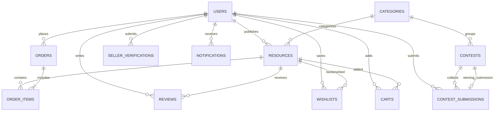

# Database Design & Entity Relationships — Noksha (নকশা)

This document provides a detailed breakdown of the relational database schema, table structures, column definitions, data types, indexes, and entity relationships in **Noksha (নকশা)**.

---

## 1. Database Entity Relationship Diagram (ERD)

---

## 2. Comprehensive Table Definitions

### 1. `users` Table
Stores user credentials, roles, profile metadata, trust score, and account status.

| Column | Type | Attributes | Description |
| :--- | :--- | :--- | :--- |
| `id` | `BIGINT` | `PK`, `UNSIGNED`, `AUTO_INCREMENT` | Primary Key |
| `name` | `VARCHAR(255)` | `NOT NULL` | Full Name |
| `username` | `VARCHAR(255)` | `UNIQUE`, `NOT NULL` | Username handle |
| `email` | `VARCHAR(255)` | `UNIQUE`, `NOT NULL` | Email Address |
| `password` | `VARCHAR(255)` | `NOT NULL` | Bcrypt hashed password |
| `role` | `ENUM` | `['super_admin','admin','user']`, Default: `user` | Authorization role |
| `status` | `VARCHAR(255)` | Default: `active` | Account status (`active`, `suspended`) |
| `trust_score` | `DECIMAL(5,2)`| Default: `100.00` | Reputation trust score |
| `is_verified` | `BOOLEAN` | Default: `false` | KYC verification flag |
| `created_at` | `TIMESTAMP` | `NULL` | Creation timestamp |

---

### 2. `categories` Table
Classifies graphics resources and design contests into structured topics.

| Column | Type | Attributes | Description |
| :--- | :--- | :--- | :--- |
| `id` | `BIGINT` | `PK`, `UNSIGNED` | Primary Key |
| `name` | `VARCHAR(255)` | `NOT NULL` | Category Title (e.g. Mobile UI, Vectors) |
| `slug` | `VARCHAR(255)` | `UNIQUE`, `NOT NULL` | URL-friendly slug |
| `icon` | `VARCHAR(255)` | `NULLABLE` | Bootstrap Icon class |

---

### 3. `resources` Table
Stores uploaded graphics assets, file paths, pricing, auto-generated tags, and view/download telemetry.

| Column | Type | Attributes | Description |
| :--- | :--- | :--- | :--- |
| `id` | `BIGINT` | `PK`, `UNSIGNED` | Primary Key |
| `user_id` | `BIGINT` | `FK`, `constrained('users')` | Author/Seller foreign key |
| `category_id` | `BIGINT` | `FK`, `NULLABLE` | Category foreign key |
| `title` | `VARCHAR(255)` | `NOT NULL` | Asset Title |
| `slug` | `VARCHAR(255)` | `UNIQUE`, `NOT NULL` | Asset Slug |
| `description` | `TEXT` | `NOT NULL` | Asset Description |
| `preview_image` | `VARCHAR(255)` | `NOT NULL` | Path to preview image |
| `file_path` | `VARCHAR(255)` | `NOT NULL` | Path to downloadable resource file |
| `file_type` | `VARCHAR(50)` | `NOT NULL` | File format (`zip`, `psd`, `ai`, `svg`) |
| `tags` | `JSON` | `NULLABLE` | Auto-generated & manual tag array |
| `is_paid` | `BOOLEAN` | Default: `false` | Pricing flag |
| `price` | `DECIMAL(10,2)`| Default: `0.00` | Asset price in BDT (৳) |
| `status` | `ENUM` | `['pending','approved','rejected']` | Moderation status |
| `downloads` | `BIGINT` | Default: `0` | Total download counter |
| `views` | `BIGINT` | Default: `0` | Total view counter |

---

### 4. `orders` Table
Records customer purchases, transaction IDs, payment methods, and total amounts.

| Column | Type | Attributes | Description |
| :--- | :--- | :--- | :--- |
| `id` | `BIGINT` | `PK`, `UNSIGNED` | Primary Key |
| `user_id` | `BIGINT` | `FK`, `constrained('users')` | Buyer foreign key |
| `order_number` | `VARCHAR(255)` | `UNIQUE`, `NOT NULL` | Unique Order Code |
| `total` | `DECIMAL(10,2)`| `NOT NULL` | Total order amount in BDT (৳) |
| `payment_status`| `VARCHAR(50)` | Default: `completed` | Payment status |
| `payment_method`| `VARCHAR(50)` | Default: `bkash` | Selected payment gateway |
| `transaction_id`| `VARCHAR(255)` | `NULLABLE` | Gateway transaction reference |

---

### 5. `order_items` Table
Line items mapping orders to specific purchased resources.

| Column | Type | Attributes | Description |
| :--- | :--- | :--- | :--- |
| `id` | `BIGINT` | `PK`, `UNSIGNED` | Primary Key |
| `order_id` | `BIGINT` | `FK`, `cascadeOnDelete()` | Parent order foreign key |
| `resource_id` | `BIGINT` | `FK`, `constrained('resources')` | Target resource foreign key |
| `price` | `DECIMAL(10,2)`| `NOT NULL` | Unit price at time of order |
| `quantity` | `INT` | Default: `1` | Quantity |

---

### 6. `reviews` Table
Customer star ratings (1-5) and text feedback for verified asset purchases.

| Column | Type | Attributes | Description |
| :--- | :--- | :--- | :--- |
| `id` | `BIGINT` | `PK`, `UNSIGNED` | Primary Key |
| `user_id` | `BIGINT` | `FK`, `constrained('users')` | Buyer foreign key |
| `resource_id` | `BIGINT` | `FK`, `constrained('resources')` | Target resource foreign key |
| `rating` | `TINYINT` | `NOT NULL` | Rating score (1 to 5) |
| `comment` | `TEXT` | `NOT NULL` | Review feedback text |

---

### 7. `seller_verifications` Table
Identity documents submitted by sellers for Pro Author KYC verification.

| Column | Type | Attributes | Description |
| :--- | :--- | :--- | :--- |
| `id` | `BIGINT` | `PK`, `UNSIGNED` | Primary Key |
| `user_id` | `BIGINT` | `FK`, `constrained('users')` | Seller foreign key |
| `full_name` | `VARCHAR(255)` | `NOT NULL` | Legal full name |
| `document_type` | `VARCHAR(50)` | `NOT NULL` | `nid`, `passport`, `driving_license` |
| `document_file` | `VARCHAR(255)` | `NOT NULL` | Uploaded document path |
| `selfie_file` | `VARCHAR(255)` | `NOT NULL` | Uploaded selfie image path |
| `status` | `ENUM` | `['pending','approved','rejected']` | Compliance status |

---

### 8. `contests` & `contest_submissions` Tables
Manages sponsored design challenges, prize pools, submission entries, and winning creators.

---

### 9. `notifications` Table
Stores real-time in-app alerts, read status, and redirect URLs.

| Column | Type | Attributes | Description |
| :--- | :--- | :--- | :--- |
| `id` | `BIGINT` | `PK`, `UNSIGNED` | Primary Key |
| `user_id` | `BIGINT` | `FK`, `constrained('users')` | Recipient foreign key |
| `title` | `VARCHAR(255)` | `NOT NULL` | Alert title |
| `message` | `TEXT` | `NOT NULL` | Notification message text |
| `type` | `VARCHAR(50)` | Default: `system` | Category (`seller`, `buyer`, `admin`) |
| `action_url` | `VARCHAR(255)` | `NULLABLE` | Target redirect URL |
| `is_read` | `BOOLEAN` | Default: `false` | Read flag |
