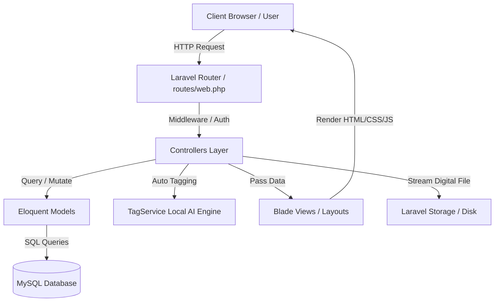
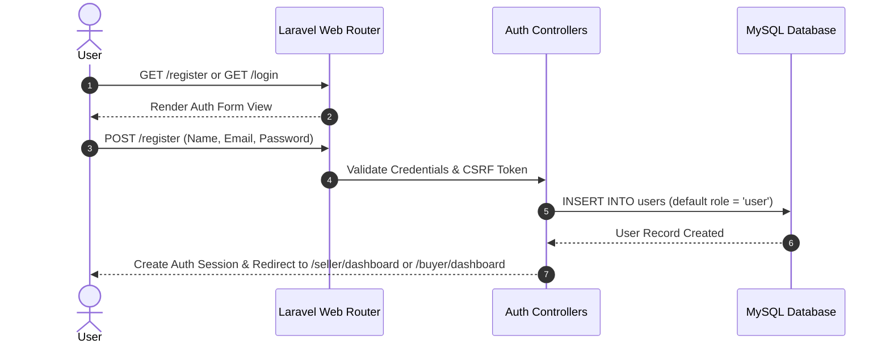
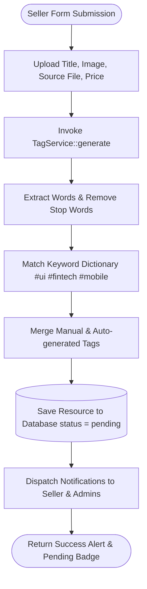
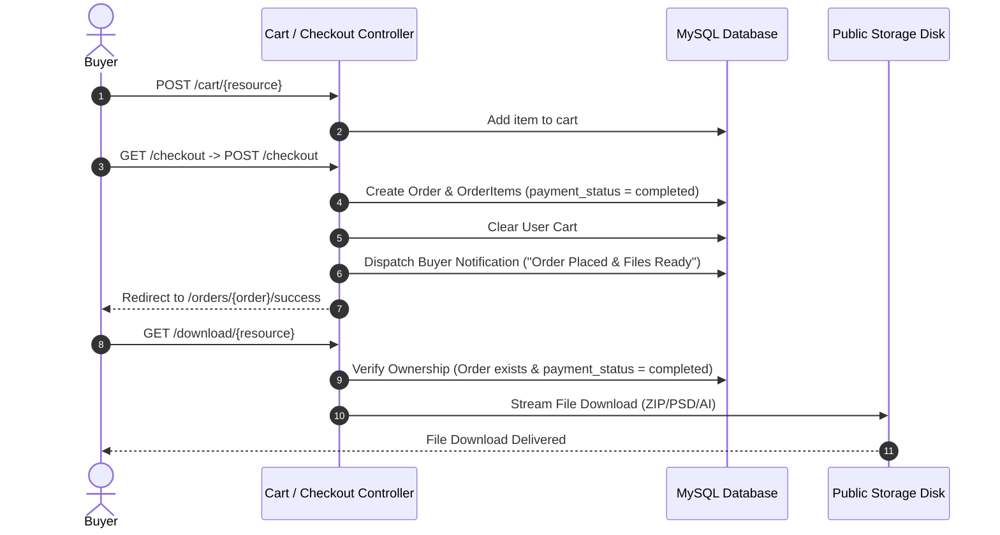
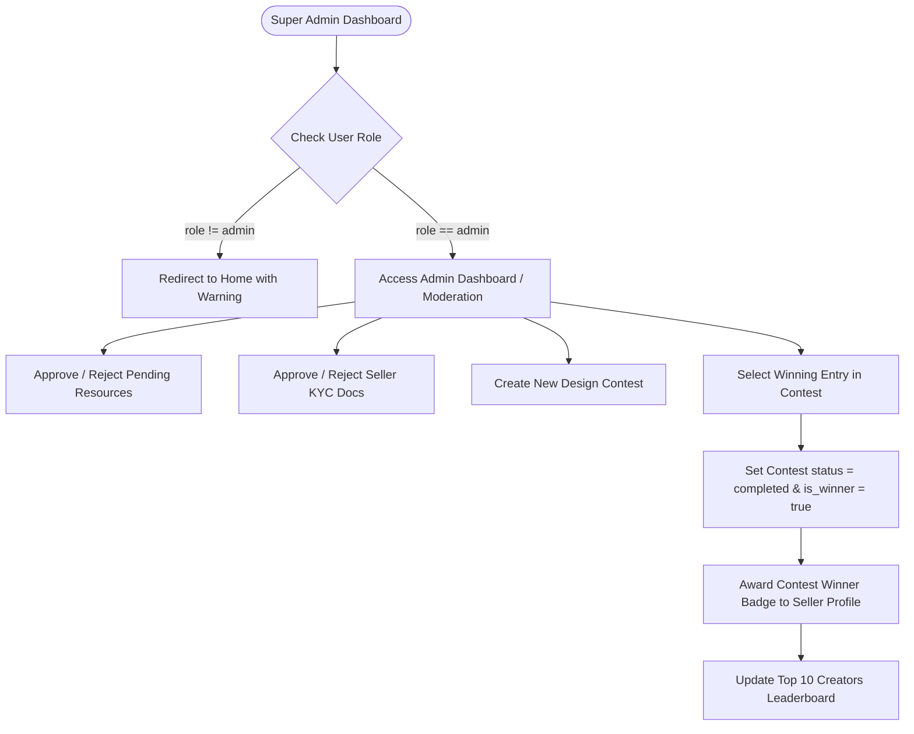

# System Architecture & Flow Diagrams — Noksha (নকশা)

This document details the architectural layout, component layers, and workflow diagrams for **Noksha (নকশা)**.

---

## 1. High-Level System Architecture

Noksha is structured following Laravel's standard **Model-View-Controller (MVC)** architectural pattern:

---

## 2. User Authentication & Registration Flow

---

## 3. Seller Upload & Local AI Auto-Tagging Flow

---

## 4. Buyer Checkout & File Streaming Flow

---

## 5. Super Admin Moderation & Winner Selection Flow

